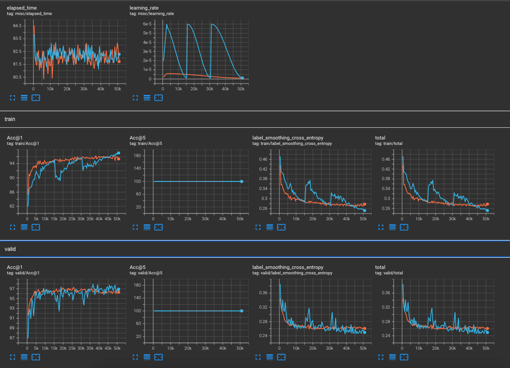

## SegFormer model with PyNetsPresso Compressor


### Structural pruning with automatic compression

Succeess in training compressed model.

### Retrain with your compressed model

After compressing the model with PyNetsPresso Compressor, we recommend you to re-train the compressed model with your own dataset.  
We'll provide an example script for re-training the compressed model with our trainer.

```bash
python train_fx.py\
  --data config/data/beans.yaml\
  --augmentation config/augmentation/segmentation.yaml\
  --model config/model/segformer/segformer.yaml\
  --training config/training/segmentation.yaml\
  --logging config/logging.yaml\
  --environment config/environment.yaml\
  --fx-model-checkpoint segmentation_segformer_fx.pt
```

Here is the example tensorboard image in the below, where <span style="color:orange">orange line</span> is the training result compressed with `GlobalPruning` with the ratio of `0.4`, and the  <span style="color:skyblue">skyblue line</span> is the original training result (finetuning from ImageNet pretrained weight).



<br/>
<br/>